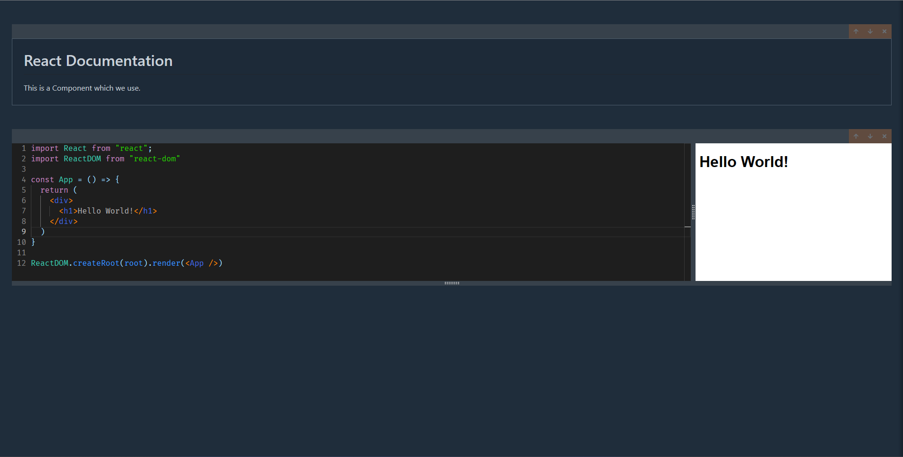

# JBook App

This is an application for quickly document JavaScript Code. Also we can use any package which is available on `npm registry`.

We can resize the code editor, the markdown editor and the preview window.

We have a special function `show()`. 

If we write `show("Hello")` in the code editor, `"Hello"` will appear in the preview window.

## In action

#### Code Editing

#### Markdown Editing

